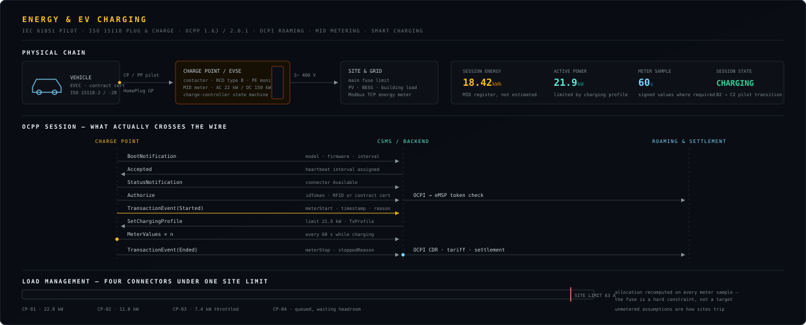
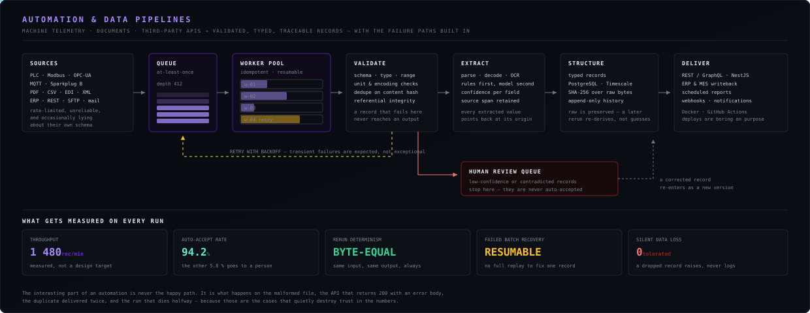

<div align="center">


</div>

<br>

<div align="center">


<br>


<br>


<br>


<br>


<br>


</div>

<br>

<div align="center">
<table>
<tr>
<td align="center" width="25%">
<h3>6</h3>
<sub><b>DOMAINS, ONE STACK</b></sub><br>
<sub>schematic through app store</sub>
</td>
<td align="center" width="25%">
<h3>20+</h3>
<sub><b>BUS &amp; PROTOCOL STANDARDS</b></sub><br>
<sub>spoken natively, not wrapped</sub>
</td>
<td align="center" width="25%">
<h3>1</h3>
<sub><b>TIMESTAMP DOMAIN</b></sub><br>
<sub>every source on one timeline</sub>
</td>
<td align="center" width="25%">
<h3>0</h3>
<sub><b>SILENT FAILURES</b></sub><br>
<sub>a dropped record raises, never logs</sub>
</td>
</tr>
</table>
</div>

---

<h2>What I build</h2>

<blockquote>
<b>Systems where a physical thing, a protocol, and a number in a database all have to agree — and someone has to be able to prove it later.</b>
</blockquote>

That covers a wider surface than it sounds: a charge point negotiating **OCPP** with a backend, a
production line pushing **Modbus** and **OPC-UA** into a time-series store, a vehicle network
captured with hardware timestamps, an **RF** link that has to survive a real building, a document
pipeline turning unstructured input into typed records, and the phone app on the other end of all of
it.

The skills transfer because the hard parts are the same everywhere — the protocol edge case, the
measurement that was never actually measured, the failure path nobody exercised, and the number
whose origin nobody can reconstruct six months later.

---

<h2>Domains, and how deep each one goes</h2>

<div align="center">


</div>

<details>
<summary><b>&nbsp;What "filled / amber / outline" honestly means here</b></summary>

<br>

<table>
<tr><td width="18%"><b>filled</b></td><td>I design it, debug it at the signal or wire level, and ship it. If it breaks at 2 a.m., I can find out why without help.</td></tr>
<tr><td><b>amber</b></td><td>I work in it productively and have delivered in it, but I would pull in a specialist for the extreme end — a certification-grade RF layout, a safety-rated PLC program.</td></tr>
<tr><td><b>outline</b></td><td>Adjacent. I read it, review it, and integrate against it — I do not claim to originate it.</td></tr>
</table>

An honest matrix has outline cells in it. A profile where every cell is filled is a profile that has
not been checked against reality.

</details>

---

<h2>Energy &amp; EV charging</h2>

<div align="center">



</div>

**OCPP 1.6J and 2.0.1**, **OCPI** roaming, **ISO 15118** Plug &amp; Charge, **IEC 61851** pilot
signalling, MID metering, and smart-charging profiles under a real site limit. Charge-point
firmware on one side, the CSMS and settlement data on the other.

<details>
<summary><b>&nbsp;The three things that quietly break charging deployments</b></summary>

<br>

<table>
<tr><td width="33%" valign="top">

**Energy that isn't measured**

A session billed from a value the controller *calculated* rather than a register the meter
*reported* is a dispute waiting to happen. Where the regulation requires a signed value, an
inferred one is not a shortcut — it is a defect.

</td><td width="33%" valign="top">

**Load management as a target**

The main fuse is a hard constraint, not a setpoint to aim at. Allocation has to be recomputed on
every meter sample, and a connector that cannot get headroom must queue visibly rather than silently
under-deliver.

</td><td width="33%" valign="top">

**Interop assumed, not tested**

Two implementations both "OCPP 2.0.1 compliant" still disagree on transaction identity, offline
behaviour and reconnection. That gets found on a live site unless it is exercised against a real
counterparty first.

</td></tr>
</table>

Offline behaviour deserves its own line: the backend link *will* drop. What the charge point does
during that window — keep charging, queue transaction events, and reconcile without duplicating or
losing a session — is the difference between a product and a demo.

</details>

---

<h2>Automation &amp; data pipelines</h2>

<div align="center">



</div>

Machine telemetry, documents, and third-party APIs turned into validated, typed, traceable records —
with the retry path, the human-review queue and the resume-after-crash behaviour designed in from
the start rather than bolted on after the first bad run.

<details>
<summary><b>&nbsp;Why the happy path is the least interesting part of an automation</b></summary>

<br>

<table>
<tr><td width="50%" valign="top">

**Failure modes that actually occur**

- an API returning **HTTP 200 with an error body** — the single most common cause of silently
  corrupt datasets
- the same file delivered twice, hours apart, with one field changed
- a schema that shifts without a version bump
- a run that dies at 60% and has no way to resume except full replay
- an extraction confident enough to write, wrong enough to matter

</td><td width="50%" valign="top">

**What that forces into the design**

- validation *before* persistence, never after
- dedupe on content hash, not on filename or timestamp
- idempotent workers — reprocessing must be safe by construction
- append-only history, so a correction is a new version rather than an overwrite
- a confidence threshold below which nothing is auto-accepted and a person is asked

</td></tr>
</table>

The measurable outcome is boring and that is the point: same input, same output, byte-equal, on a
rerun six months later — and every number in the final report traceable back to the exact bytes it
came from.

</details>

---

<h2>Vehicle networks &amp; signal integrity</h2>

<div align="center">


</div>

**CAN and CAN-FD**, **LIN**, **K-Line**, **Automotive Ethernet**, **UDS** and **OBD-II** — captured
with hardware timestamps, decoded, and correlated against the analog reality on the wire.

<table>
<tr>
<td width="34%" valign="top">

#### Measurement, split correctly
Slow precision analog and high-speed physical-layer capture are **different subsystems**. A 24-bit
simultaneous ADC is right for supply rails and CANH/CANL behaviour — and useless for nanosecond edge
ringing. Conflating them is how a spec sheet becomes fiction.

</td>
<td width="33%" valign="top">

#### Timing is measured, not inferred
An FPGA in the block diagram is not evidence of nanosecond accuracy. Latency and jitter get
characterised on the bench against a disciplined reference before either number appears in a
document.

</td>
<td width="33%" valign="top">

#### Receive-only by default
Anything that can reach a live bus stays receive-only until every condition in the transmit chain
agrees — **per channel, never one shared gate**, because a shared gate turns a single fault into a
multi-bus event.

</td>
</tr>
</table>

<details>
<summary><b>&nbsp;How the transmit-permission chain actually works</b></summary>

<br>

```
  service permission ──┐
                       │
  supervisor healthy ──┼──> AND ──> TX ENABLED  (this channel only)
                       │
   FPGA permission ────┤
                       │
     MCU request ──────┘

  any input false ────────> fail silent, receive-only
```

Failure modes this is built against: a supervisor brown-out mid-transaction, firmware asserting a
request the hardware never authorised, and one channel's fault propagating into its neighbours. The
last one is why the gate is replicated rather than shared — it costs more silicon and it is not
negotiable.

</details>

<details>
<summary><b>&nbsp;What a capture carries before it is allowed on the timeline</b></summary>

<br>

<table>
<tr><td width="30%"><b>timestamp</b></td><td>from the disciplined domain, not the host OS clock</td></tr>
<tr><td><b>source</b></td><td>which physical interface, in which mode, on which unit</td></tr>
<tr><td><b>identity</b></td><td>so a combined timeline can be pulled apart again</td></tr>
<tr><td><b>content hash</b></td><td>SHA-256 over the raw bytes, before any normalisation</td></tr>
<tr><td><b>uncertainty</b></td><td>the honest error bar — absent uncertainty is a red flag, not a clean result</td></tr>
</table>

Raw is preserved and never overwritten by a derived view. If a later analysis disagrees with an
earlier one, both stay re-derivable from the same stored bytes — the difference between an evidence
trail and a log file.

</details>

---

<h2>Hardware &amp; board bring-up</h2>

<div align="center">


</div>

**KiCad** schematic and layout, isolation and power-tree review before anything is energised,
enforced ERC and DRC, deterministic diffs, and manufacturing output gated on a human decision —
because a board that can reach a live network is not a place for silent automation.

---

<h2>Prototype → manufacture</h2>

<div align="center">


</div>

Every gate has an exit criterion. A mistake caught at schematic costs an afternoon; the same mistake
caught at pilot costs a tooling run and a lead time.

<details>
<summary><b>&nbsp;Two things that get planned late and hurt</b></summary>

<br>

<table>
<tr><td width="50%" valign="top">

**Export control**

Dual-use RF, spectrum monitoring and direction-finding hardware fall under **EU Regulation
2021/821**, administered in Germany by **BAFA**. It decides whether a unit can legally cross a
border, be demonstrated abroad, or join a multi-country consortium.

It is a *classification* question first — what the hardware is capable of, not what it is marketed
as — and the answer shapes the BOM. Discovering it after Rev B is expensive.

</td><td width="50%" valign="top">

**Bench unit ≠ fielded unit**

A bench box and a unit deployed in an industrial or outdoor environment are different products. The
step between them is ruggedisation, EMC qualification, environmental and vibration testing, sealing,
thermal derating, and a supply chain that survives a multi-year build.

The gap is routinely underestimated because the schematic barely changes. The cost and the calendar
do.

</td></tr>
</table>

</details>

---

<h2>Mobile &amp; connected product</h2>

<div align="center">


</div>

**Flutter** and **React Native** where cross-platform is right; **Kotlin** and **Swift** when
background BLE has to survive the OS, or when MTU and throughput tuning decide whether the product
works at all. The device is half a product — the other half is what someone holds, and that half is
usually where connected hardware actually fails.

<details>
<summary><b>&nbsp;The four app-side failures that break connected hardware in the field</b></summary>

<br>

<table>
<tr><td width="25%" valign="top">

**Provisioning**
Works perfectly on the developer's desk with one device and clean RF. Fails in a room with forty
devices, a bad advertising interval, and a user who backgrounds the app halfway through pairing.

</td><td width="25%" valign="top">

**OTA rollback**
Almost every product has A/B slots. Far fewer have *exercised* the rollback path — pulled power
mid-write, corrupted the image deliberately, confirmed the unit still boots the old slot.

</td><td width="25%" valign="top">

**Pairing recovery**
Interruption is the normal case, not the exception. Lift, walk out of range, take a call. State that
cannot resume from a partial handshake produces a device that must be factory-reset.

</td><td width="25%" valign="top">

**Fleet truth**
A device offline for a week is not "healthy" and not "failed" — it is *unknown*. Dashboards that
collapse those three states into two are the reason nobody trusts the dashboard.

</td></tr>
</table>

</details>

---

<h2>Principles I don't bend</h2>

<table>
<tr><td width="50%" valign="top">

**Reproduce before fixing**
A failure I can't trigger on demand isn't diagnosed — it's a guess with a stack trace attached. Most
"flaky" hardware is perfectly deterministic once the right variable is under control.

</td><td width="50%" valign="top">

**Fail silent by default**
Receive-only until every condition agrees. Per channel. Never a shared gate. A system that cannot
act is always safer than one that acts wrongly.

</td></tr>
<tr><td width="50%" valign="top">

**Smallest change that solves it**
No rewrite sold as a fix. The change should be small enough that a reviewer can hold the whole thing
in their head.

</td><td width="50%" valign="top">

**Evidence over claims**
Timestamps, traces, exact firmware revisions, measured before and after. If a conclusion can't be
re-derived from stored artefacts by someone else, it isn't finished.

</td></tr>
</table>
