<div align="center">


</div>

<br>

<div align="center">


<br>


<br>


<br>


<br>


<br>


</div>

<br>

<div align="center">
<table>
<tr>
<td align="center" width="20%">
<h3>8</h3>
<sub><b>INSTRUMENT NODES</b></sub><br>
<sub>each one standalone</sub>
</td>
<td align="center" width="20%">
<h3>5</h3>
<sub><b>CONTRACT ENDPOINTS</b></sub><br>
<sub>every node speaks them</sub>
</td>
<td align="center" width="20%">
<h3>20+</h3>
<sub><b>BUS &amp; PROTOCOL STANDARDS</b></sub><br>
<sub>spoken natively, not wrapped</sub>
</td>
<td align="center" width="20%">
<h3>1</h3>
<sub><b>TIMESTAMP DOMAIN</b></sub><br>
<sub>every source, one timeline</sub>
</td>
<td align="center" width="20%">
<h3>0</h3>
<sub><b>SILENT FAILURES</b></sub><br>
<sub>a dropped record raises</sub>
</td>
</tr>
</table>
</div>

---

<h2>The constraint everything else follows from</h2>

<blockquote>
<b>Every node is a complete instrument. The control plane must never become a dependency.</b>
</blockquote>

Take the automotive node to a bench with nothing but a laptop — it still captures, timestamps and
hashes its own evidence. Add the control plane and eight independent instruments become one
correlated system. Remove it and nothing stops working.

That single rule is why the platform scales sideways: adding a ninth node never forces a redesign of
the other eight. It's also what makes the whole thing agent-addressable — an expert layer can
discover capabilities, request captures and correlate across domains, because every node answers the
same five endpoints.

<details>
<summary><b>&nbsp;Why a mandatory control plane would have been the easier — and wrong — design</b></summary>

<br>

A central plane that owns time, identity and storage is simpler to build. Every node gets thinner,
the schema lives in one place, and you never reconcile two clocks. The cost only appears later:

<table>
<tr><td width="50%" valign="top">

**What you gain by centralising**
- one clock, one schema, one storage path
- thinner nodes, cheaper BOM per unit
- a single place to reason about identity

</td><td width="50%" valign="top">

**What you lose, permanently**
- a node alone on a bench becomes useless
- the plane becomes the single point of failure
- every new node negotiates with a central design
- field work needs the whole rack, not one box

</td></tr>
</table>

The deciding case is the ordinary one: an engineer takes a single node to a vehicle, a substation or
a customer site. If that requires the rack, the platform has failed at the exact moment it matters
most. So the plane earns its place by adding correlation — never by being required.

</details>

---

<h2>Signal integrity &amp; vehicle networks</h2>

<div align="center">


</div>

**CAN and CAN-FD**, **LIN**, **K-Line**, **Automotive Ethernet**, **UDS** and **OBD-II** — captured
with hardware timestamps, decoded, and correlated against the analog reality on the wire.

<table>
<tr>
<td width="34%" valign="top">

#### Measurement, split correctly
Slow precision analog and high-speed physical-layer capture are **different subsystems**. A 24-bit
simultaneous ADC is right for supply rails and CANH/CANL behaviour — and useless for nanosecond edge
ringing. Conflating them is how a spec sheet becomes fiction.

</td>
<td width="33%" valign="top">

#### Timing is measured, not inferred
An FPGA in the block diagram is not evidence of nanosecond accuracy. Latency and jitter get
characterised on the bench against a disciplined reference before either number appears in a
document.

</td>
<td width="33%" valign="top">

#### Evidence is an output, not a log
Capture → Source → EvidenceLink, hash-tracked on one timebase. An RF observation, a bus frame, a
camera event and an analog measurement land on the same timeline — which is what makes cross-domain
reasoning defensible instead of suggestive.

</td>
</tr>
</table>

<details>
<summary><b>&nbsp;How the transmit-permission chain actually works</b></summary>

<br>

Anything that can reach a live bus defaults to receive-only. Transmit requires **every** condition to
agree, and the chain is per channel — never one shared gate, because a shared gate turns a single
fault into a multi-bus event.

```
  service permission ──┐
                       │
  supervisor healthy ──┼──> AND ──> TX ENABLED  (this channel only)
                       │
   FPGA permission ────┤
                       │
     MCU request ──────┘

  any input false ────────> fail silent, receive-only
```

Failure modes this is built against: a supervisor brown-out mid-transaction, firmware asserting a
request the hardware never authorised, and one channel's fault propagating into the other fifteen.
The last one is why the gate is replicated rather than shared — it costs more silicon and it is not
negotiable.

</details>

<details>
<summary><b>&nbsp;What a capture carries before it is allowed on the timeline</b></summary>

<br>

<table>
<tr><td width="30%"><b>timestamp</b></td><td>from the disciplined domain, not the host OS clock</td></tr>
<tr><td><b>source</b></td><td>which physical interface, on which node, in which mode</td></tr>
<tr><td><b>node identity</b></td><td>so a federated timeline can be pulled apart again</td></tr>
<tr><td><b>content hash</b></td><td>SHA-256 over the raw bytes, before any normalisation</td></tr>
<tr><td><b>uncertainty</b></td><td>the honest error bar — absent uncertainty is a red flag, not a clean result</td></tr>
</table>

Raw is preserved and never overwritten by a derived view. If a later analysis disagrees with an
earlier one, both remain re-derivable from the same stored bytes — which is the difference between an
evidence trail and a log file.

</details>

---

<h2>Business-process &amp; production automation</h2>

<div align="center">


</div>

ERP and MES, machine telemetry over **Modbus** and **OPC-UA**, documents, mailboxes, third-party APIs
— pulled into one pipeline that produces validated, typed, traceable records. The retry path, the
dead-letter route, the human-review queue and resume-after-crash are part of the design, not patches
added after the first bad run.

<details>
<summary><b>&nbsp;Why the happy path is the least interesting part of an automation</b></summary>

<br>

<table>
<tr><td width="50%" valign="top">

**Failure modes that actually occur**

- an API returning **HTTP 200 with an error body** — the single most common cause of silently corrupt
  datasets
- the same file delivered twice, hours apart, with one field changed
- a schema that shifts without a version bump
- a run that dies at 60% with no way to resume except full replay
- an extraction confident enough to write, wrong enough to matter
- the undocumented exception rule that lives only in one person's head

</td><td width="50%" valign="top">

**What that forces into the design**

- validation *before* persistence, never after
- dedupe on content hash, not on filename or timestamp
- idempotent workers — reprocessing must be safe by construction
- arrival time and event time stored separately, because they are not the same thing
- append-only history, so a correction is a new version rather than an overwrite
- a confidence threshold below which nothing is auto-accepted and a person decides

</td></tr>
</table>

The measurable outcome is deliberately boring: same input, same output, byte-equal, on a rerun six
months later — and every number in the final report traceable back to the exact bytes it came from.

</details>

<details>
<summary><b>&nbsp;Extraction order: rules first, model second</b></summary>

<br>

<table>
<tr><td width="25%"><b>1 · layout match</b></td><td>known sender, known template — deterministic, free, and correct</td></tr>
<tr><td><b>2 · grammar &amp; regex</b></td><td>structured fields with a defined shape: dates, references, totals, units</td></tr>
<tr><td><b>3 · model pass</b></td><td>only for what survives the first two — the genuinely unstructured residue</td></tr>
<tr><td><b>4 · confidence</b></td><td>scored per field, not per document, with the source span retained</td></tr>
</table>

Running the model first is faster to build and worse in every other way: it costs more per document,
it is non-deterministic on reruns, and it removes the ability to say *why* a value is what it is. A
field that a rule can decide should never be decided by a guess.

</details>

---

<h2>Energy &amp; EV charging</h2>

<div align="center">


</div>

**OCPP 1.6J and 2.0.1**, **OCPI** roaming, **ISO 15118** Plug &amp; Charge, **IEC 61851** pilot
signalling, MID metering, and smart-charging profiles under a real site limit. Charge-point firmware
on one side, the backend and settlement data on the other.

<details>
<summary><b>&nbsp;The three things that quietly break charging deployments</b></summary>

<br>

<table>
<tr><td width="33%" valign="top">

**Energy that isn't measured**

A session billed from a value the controller *calculated* rather than a register the meter *reported*
is a dispute waiting to happen. Where regulation requires a signed value, an inferred one is not a
shortcut — it is a defect.

</td><td width="33%" valign="top">

**Load management as a target**

The main fuse is a hard constraint, not a setpoint to aim at. Allocation has to be recomputed on
every meter sample, and a connector that cannot get headroom must queue visibly rather than silently
under-deliver.

</td><td width="33%" valign="top">

**Interop assumed, not tested**

Two implementations both "2.0.1 compliant" still disagree on transaction identity, offline behaviour
and reconnection. That gets discovered on a live site unless it is exercised against a real
counterparty first.

</td></tr>
</table>

Offline behaviour deserves its own line: the backend link *will* drop. What the charge point does
during that window — keep charging, queue transaction events, and reconcile afterwards without
duplicating or losing a session — is the difference between a product and a demo.

</details>

---

<h2>Life-science &amp; metabolic data</h2>

<div align="center">



</div>

Multi-omics ingestion, pathway and flux modelling, target ranking, and dose–response
characterisation — built on the same discipline as everything above: versioned raw data, a pinned
environment, pre-specified analysis, and negative results kept beside positive ones.

<details>
<summary><b>&nbsp;Where quantitative biology goes wrong, and what stops it</b></summary>

<br>

<table>
<tr><td width="50%" valign="top">

**The recurring failures**

- an uncorrected p-value across twenty thousand features presented as a finding
- technical replicates counted as biological ones, inflating every confidence interval
- missing values in mass-spec data imputed as zeros
- batch effect mistaken for biological signal
- a dose–response fit with no plateau — an extrapolation wearing the costume of a curve
- a target that correlates with the phenotype and never moves it

</td><td width="50%" valign="top">

**What the pipeline enforces**

- raw immutable, SHA-256 per dataset, every figure naming its exact input
- containerised analysis with locked dependencies and fixed seeds
- endpoints and tests pre-specified; anything else labelled exploratory
- imputation and normalisation choices recorded as part of the result
- the failed arm stored beside the successful one

</td></tr>
</table>

Attrition is the honest headline: the great majority of programmes that clear target identification
never reach a candidate molecule. So the value of the work sits in killing the wrong hypothesis
cheaply and early — not in defending it late.

</details>

---

<h2>Mobile &amp; connected product</h2>

<div align="center">


</div>

**Flutter** and **React Native** where cross-platform is right; **Kotlin** and **Swift** when
background BLE has to survive the OS, or when MTU and throughput tuning decide whether the product
works at all. The instrument is half a product — the other half is what someone holds, and that half
is usually where connected hardware actually fails.

<details>
<summary><b>&nbsp;The four app-side failures that break connected hardware in the field</b></summary>

<br>

<table>
<tr><td width="25%" valign="top">

**Provisioning**
Works perfectly on the developer's desk with one device and clean RF. Fails in a room with forty
devices, a bad advertising interval, and a user who backgrounds the app halfway through pairing.

</td><td width="25%" valign="top">

**OTA rollback**
Almost every product has A/B slots. Far fewer have *exercised* the rollback path — pulled power
mid-write, corrupted the image deliberately, confirmed the unit still boots the old slot.

</td><td width="25%" valign="top">

**Pairing recovery**
Interruption is the normal case, not the exception. Lift, walk out of range, take a call. State that
can't resume from a partial handshake produces a device that must be factory-reset.

</td><td width="25%" valign="top">

**Fleet truth**
A device offline for a week is not "healthy" and not "failed" — it is *unknown*. Dashboards that
collapse those three states into two are the reason nobody trusts the dashboard.

</td></tr>
</table>

</details>

---

<h2>From schematic to first power-on</h2>

<div align="center">


</div>

Isolation and power-tree get reviewed before anything is energised. ERC and DRC are enforced, diffs
stay deterministic, and manufacturing output requires a human decision — a bench instrument that can
reach a vehicle network is not a place for silent automation.

---

<h2>Prototype → manufacture</h2>

<div align="center">


</div>

Every gate has an exit criterion. A mistake caught at schematic costs an afternoon; the same mistake
caught at pilot costs a tooling run and a lead time.

<details>
<summary><b>&nbsp;Two things that get planned late and hurt</b></summary>

<br>

<table>
<tr><td width="50%" valign="top">

**Export control**

Dual-use RF, spectrum monitoring and direction-finding hardware fall under **EU Regulation
2021/821**, administered in Germany by **BAFA**. This decides whether a unit can legally cross a
border, be demonstrated abroad, or be contributed to a multi-country consortium.

It is a *classification* question first — what the hardware is capable of, not what it is marketed as
— and the answer shapes the BOM. Discovering it after Rev B is expensive.

</td><td width="50%" valign="top">

**Bench instrument ≠ fielded unit**

A receive-only bench box and a unit deployed in a contested or industrial environment are different
products. The step between them is ruggedisation, EMC qualification, environmental and vibration
testing, sealing, thermal derating and a supply chain that survives a multi-year build.

The gap is routinely underestimated because the schematic barely changes. The cost and calendar do.

</td></tr>
</table>

</details>

---

<h2>Where each domain touches the stack</h2>

<div align="center">


</div>

<details>
<summary><b>&nbsp;What "filled / amber / outline" honestly means here</b></summary>

<br>

<table>
<tr><td width="18%"><b>filled</b></td><td>I design it, debug it at the signal or wire level, and ship it. If it breaks at 2 a.m., I can find out why without help.</td></tr>
<tr><td><b>amber</b></td><td>I work in it productively and have delivered in it, but I would pull in a specialist for the extreme end — a certification-grade RF layout, a safety-rated PLC program.</td></tr>
<tr><td><b>outline</b></td><td>Adjacent. I read it, review it, and integrate against it — I do not claim to originate it.</td></tr>
</table>

An honest matrix has outline cells in it. A profile where every cell is filled is a profile that has
not been checked against reality.

</details>

---

<h2>Principles I don't bend</h2>

<table>
<tr><td width="50%" valign="top">

**Reproduce before fixing**
A failure I can't trigger on demand isn't diagnosed — it's a guess with a stack trace attached. Most
"flaky" hardware is perfectly deterministic once the right variable is under control.

</td><td width="50%" valign="top">

**Fail silent by default**
Receive-only unless every condition in the transmit chain agrees. Per channel. Never a shared gate.

</td></tr>
<tr><td width="50%" valign="top">

**Smallest change that solves it**
No rewrite sold as a fix. The change should be small enough that a reviewer can hold the whole thing
in their head.

</td><td width="50%" valign="top">

**Evidence over claims**
Timestamps, traces, exact firmware revisions, measured before and after. If a conclusion can't be
re-derived from stored artefacts by someone else, it isn't finished.

</td></tr>
</table>
