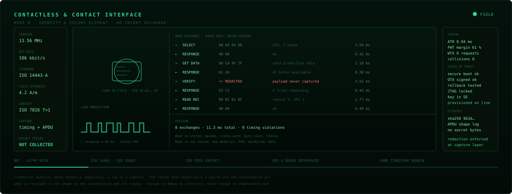
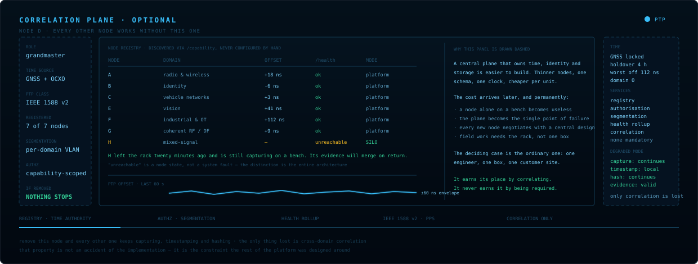
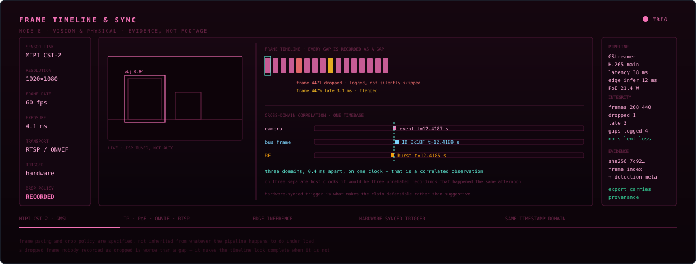

<div align="center">


</div>

<br>

<div align="center">


<br>


<br>


<br>


<br>


<br>


</div>

<br>

<div align="center">
<table>
<tr>
<td align="center" width="20%">
<h3>8+</h3>
<sub><b>INSTRUMENT NODES</b></sub><br>
<sub>open roster, each standalone</sub>
</td>
<td align="center" width="20%">
<h3>5</h3>
<sub><b>CONTRACT ENDPOINTS</b></sub><br>
<sub>every node speaks them</sub>
</td>
<td align="center" width="20%">
<h3>20+</h3>
<sub><b>BUS &amp; PROTOCOL STANDARDS</b></sub><br>
<sub>spoken natively, not wrapped</sub>
</td>
<td align="center" width="20%">
<h3>1</h3>
<sub><b>TIMESTAMP DOMAIN</b></sub><br>
<sub>every source, one timeline</sub>
</td>
<td align="center" width="20%">
<h3>0</h3>
<sub><b>SILENT FAILURES</b></sub><br>
<sub>a dropped record raises</sub>
</td>
</tr>
</table>
</div>

---

<h2>The constraint everything else follows from</h2>

<blockquote>
<b>Every node is a complete instrument. The control plane must never become a dependency.</b>
</blockquote>

Take *any* node to a bench with nothing but a laptop — radio, vehicle bus, identity reader,
industrial line, camera, direction-finding array, mixed-signal rig — and it still captures,
timestamps and hashes its own evidence. Add the control plane and those independent instruments
become one correlated system. Remove it and nothing stops working.

That single rule is why the roster is open-ended rather than fixed. Eight nodes exist today and the
list is not closed — adding the next one never forces a redesign of the ones already built. It is also
what makes the whole ecosystem agent-addressable — an expert layer can discover capabilities,
request captures and correlate across domains it was never specifically taught, because every node
answers the same five endpoints.

<h3>The ecosystem, node by node</h3>

| Node | Domain | What it speaks |
|:--:|---|---|
| **A** | Radio &amp; wireless | Wi-Fi, BLE, 802.15.4, Thread, sub-GHz, LoRaWAN, wideband SDR |
| **B** | Identity &amp; secure element | NFC, LF/HF RFID, ISO 14443, ISO 7816, POS, debug interfaces |
| **C** | Vehicle networks · *flagship* | isolated CAN-FD ×8–16, LIN, K-Line, Automotive Ethernet, FlexRay, UDS |
| **D** | Control &amp; evidence plane | registry, time authority, authorisation, segmentation, health — *the optional one* |
| **E** | Vision &amp; physical | IP, PoE, ONVIF, RTSP, MIPI CSI-2, GMSL, edge inference |
| **F** | Industrial &amp; OT | RS-485, Modbus RTU/TCP, OPC-UA, PROFINET, MQTT, Sparkplug B |
| **G** | Coherent RF &amp; direction finding | multi-channel coherent SDR, array sensing, bearing estimation |
| **H** | Hardware &amp; mixed-signal | 24-bit simultaneous ADC, FPGA timing, side-channel, power characterisation |

Energy and charging, automation pipelines and the mobile layer are not separate islands either —
they attach to the same contract and land on the same timeline. Each gets its own section below.
None of them is the platform; all of them are nodes on it.

<div align="center">



</div>

<sub>The board above lights each node in turn on a 24-second cycle, and repaints itself for your
system light or dark theme. If your OS asks for reduced motion it renders static and fully lit
instead. Each node then gets its own instrument face and full write-up below, A through H.</sub>

<h2>Node A in depth — radio &amp; wireless</h2>

<div align="center">



</div>

**Wi-Fi**, **BLE**, **802.15.4**, **Thread**, **sub-GHz** and **LoRaWAN**, plus wideband SDR capture — measured against the environment the product actually ships into, not the bench it was designed on.

<table>
<tr>
<td width="34%" valign="top">

#### The building wins
A link budget that closes on a desk meets forty competing radios, a metal rack, a closing
door and a human body that moves. Every wireless failure I have chased in the field came
from that gap, not from the protocol.

</td>
<td width="33%" valign="top">

#### RSSI is not link health
Signal strength alone says nothing about whether packets arrive. Retry rate, packet error
rate and link quality get recorded together, because a strong signal with 30% retries is a
broken link that looks healthy.

</td>
<td width="33%" valign="top">

#### Regulatory limits shape the BOM
Duty cycle and radiated power are bounded against the regional limit before a schematic
exists. A certified module does not make the product certified — the enclosure and antenna
are part of the system under test.

</td>
</tr>
</table>

<details>
<summary><b>&nbsp;What a spectrum capture is actually for</b></summary>

<br>

Not for a screenshot. The capture exists to answer one of three questions:

<table>
<tr><td width="30%"><b>is the band usable</b></td><td>occupancy and noise floor over time, not a single sweep on a quiet Sunday</td></tr>
<tr><td><b>who else is here</b></td><td>separating Wi-Fi from non-Wi-Fi emitters — the microwave, the lighting ballast, the neighbouring plant</td></tr>
<tr><td><b>is it us</b></td><td>adjacent-channel leakage and spurious emissions from our own hardware, which is the answer more often than anyone expects</td></tr>
</table>

Max-hold over minutes beats peak-detect over milliseconds, because interference is usually intermittent and the intermittent case is the one that ships and then fails.

</details>


---

<h2>Node B in depth — identity &amp; secure element</h2>

<div align="center">



</div>

**NFC**, **LF/HF RFID**, **ISO 14443**, **ISO 7816** contact cards, POS and debug interfaces — captured as protocol shape and timing, never as content.

<table>
<tr>
<td width="34%" valign="top">

#### No secret is ever recorded
Credential material does not enter a repository, a log, or a capture. The fields that would carry a secret are not collected at all — enforced at the capture layer, because discipline alone loses to a debug build that was never meant to ship.

</td>
<td width="33%" valign="top">

#### Timing is the diagnostic
Frame waiting time, response latency and WTX requests tell you what is wrong with an interface without ever needing the payload. A card that answers late under load is a different fault from one that answers wrongly.

</td>
<td width="33%" valign="top">

#### Trust is provisioned, not retrofitted
Secure boot, signed OTA with an exercised rollback path, a locked debug port and keys in a secure element are established on the production line. Adding them after the first field incident means re-touching every unit already shipped.

</td>
</tr>
</table>

<details>
<summary><b>&nbsp;The rollback path nobody exercises</b></summary>

<br>

Almost every connected product has A/B slots. Far fewer have actually pulled power midway through a write, deliberately corrupted the image, and confirmed the unit still boots the old slot and reports why.

Until that test has been run on real hardware, A/B is a diagram rather than a recovery mechanism — and the first time it matters is the worst possible time to discover the difference.

</details>


---

<h2>Node C in depth — signal integrity &amp; vehicle networks</h2>

<div align="center">


</div>

**CAN and CAN-FD**, **LIN**, **K-Line**, **Automotive Ethernet**, **UDS** and **OBD-II** — captured
with hardware timestamps, decoded, and correlated against the analog reality on the wire.

<table>
<tr>
<td width="34%" valign="top">

#### Measurement, split correctly
Slow precision analog and high-speed physical-layer capture are **different subsystems**. A 24-bit
simultaneous ADC is right for supply rails and CANH/CANL behaviour — and useless for nanosecond edge
ringing. Conflating them is how a spec sheet becomes fiction.

</td>
<td width="33%" valign="top">

#### Timing is measured, not inferred
An FPGA in the block diagram is not evidence of nanosecond accuracy. Latency and jitter get
characterised on the bench against a disciplined reference before either number appears in a
document.

</td>
<td width="33%" valign="top">

#### Evidence is an output, not a log
Capture → Source → EvidenceLink, hash-tracked on one timebase. An RF observation, a bus frame, a
camera event and an analog measurement land on the same timeline — which is what makes cross-domain
reasoning defensible instead of suggestive.

</td>
</tr>
</table>

<details>
<summary><b>&nbsp;How the transmit-permission chain actually works</b></summary>

<br>

Anything that can reach a live bus defaults to receive-only. Transmit requires **every** condition to
agree, and the chain is per channel — never one shared gate, because a shared gate turns a single
fault into a multi-bus event.

```
  service permission ──┐
                       │
  supervisor healthy ──┼──> AND ──> TX ENABLED  (this channel only)
                       │
   FPGA permission ────┤
                       │
     MCU request ──────┘

  any input false ────────> fail silent, receive-only
```

Failure modes this is built against: a supervisor brown-out mid-transaction, firmware asserting a
request the hardware never authorised, and one channel's fault propagating into the other fifteen.
The last one is why the gate is replicated rather than shared — it costs more silicon and it is not
negotiable.

</details>

<details>
<summary><b>&nbsp;What a capture carries before it is allowed on the timeline</b></summary>

<br>

<table>
<tr><td width="30%"><b>timestamp</b></td><td>from the disciplined domain, not the host OS clock</td></tr>
<tr><td><b>source</b></td><td>which physical interface, on which node, in which mode</td></tr>
<tr><td><b>node identity</b></td><td>so a federated timeline can be pulled apart again</td></tr>
<tr><td><b>content hash</b></td><td>SHA-256 over the raw bytes, before any normalisation</td></tr>
<tr><td><b>uncertainty</b></td><td>the honest error bar — absent uncertainty is a red flag, not a clean result</td></tr>
</table>

Raw is preserved and never overwritten by a derived view. If a later analysis disagrees with an
earlier one, both remain re-derivable from the same stored bytes — which is the difference between an
evidence trail and a log file.

</details>

---

<h2>Node D in depth — control &amp; evidence plane</h2>

<div align="center">



</div>

Registry, time authority, authorisation, segmentation and health. **The only optional node on the board**, and the design decision the rest of the platform is built around.

<table>
<tr>
<td width="34%" valign="top">

#### Removing it changes nothing essential
Capture continues. Timestamping continues, from the local disciplined source. Hashing continues. Evidence stays valid. The single thing lost is cross-domain correlation — which is exactly what this node is for and all it is for.

</td>
<td width="33%" valign="top">

#### Unreachable is a node state
A node that left the rack is not a system fault. It is a node in SILO mode whose evidence will merge on return. Collapsing those two things into one alarm is how a platform teaches its operators to ignore alarms.

</td>
<td width="33%" valign="top">

#### The easier design was rejected
One clock, one schema, one storage path, thinner nodes, cheaper per unit — and a plane that becomes the single point of failure, with every new node forced to negotiate against a central design.

</td>
</tr>
</table>

<details>
<summary><b>&nbsp;The deciding case is the ordinary one</b></summary>

<br>

One engineer, one box, one customer site.

If that requires the whole rack, the platform has failed at the exact moment it matters most. Everything else about the architecture — the uniform contract, the per-node evidence chain, the local time source — exists so that sentence stays true.

It also makes the roster open-ended. A ninth node negotiates with a five-endpoint contract, not with a central schema and its owners.

</details>


---

<h2>Node E in depth — vision &amp; physical</h2>

<div align="center">



</div>

**MIPI CSI-2**, **GMSL**, **IP**, **PoE**, **ONVIF** and **RTSP** with edge inference — and a hardware-synced trigger, which is what separates evidence from footage.

<table>
<tr>
<td width="34%" valign="top">

#### Every gap is recorded as a gap
A dropped frame nobody logged as dropped is worse than a hole in the record: it makes the timeline look complete when it is not. Drops and late frames are first-class entries, not silent omissions.

</td>
<td width="33%" valign="top">

#### Frame pacing is specified
Not inherited from whatever the pipeline happens to do under load. Under pressure a system must degrade the way you chose, not the way the buffer chose.

</td>
<td width="33%" valign="top">

#### One clock makes the claim
A camera event 0.4 ms from a bus frame and an RF burst, on one timebase, is a correlated observation. The same three on three host clocks are three recordings that happened the same afternoon.

</td>
</tr>
</table>

<details>
<summary><b>&nbsp;Why this node exists at all</b></summary>

<br>

A camera on its own is a well-solved problem and I would not build one. This node exists because a visual event is frequently the only human-legible anchor in an otherwise abstract timeline.

When a bus error, an RF burst and a physical movement land within a millisecond of each other, the video is what lets a person confirm the machine was right — and what lets them catch it when the machine was wrong.

</details>


---

<h2>Node F in depth — industrial &amp; OT</h2>

<div align="center">



</div>

**Modbus RTU/TCP**, **OPC-UA**, **PROFINET**, **MQTT** and **Sparkplug B** over isolated **RS-485**, 4–20 mA and 24 V I/O — with the physical layer of a factory taken seriously.

<table>
<tr>
<td width="34%" valign="top">

#### A register number is not a meaning
Half the real work is recovering what a tag represents on the floor, and that knowledge usually lives in a person rather than the PLC project file. An unmapped register is recorded as unmapped, never guessed into a unit.

</td>
<td width="33%" valign="top">

#### The uplink dropping is expected
Store-and-forward with hours of local buffer, a watchdog and a safe restart. The line does not stop because the network did, and an edge gateway that wedges silently is worse than one that crashes loudly.

</td>
<td width="33%" valign="top">

#### Raw and scaled are both kept
Scaling factors get revised when someone finally finds the right document. If only the scaled value was stored, every historical number is now wrong and unrecoverable.

</td>
</tr>
</table>

<details>
<summary><b>&nbsp;How a dashboard ends up confidently wrong</b></summary>

<br>

The failure is almost never a broken connection — those are loud and get fixed. It is a register read correctly, scaled with an assumed factor, labelled with a plausible name, and plotted on a chart that nobody questions for eleven months.

<table>
<tr><td width="34%"><b>guessed scaling</b></td><td>a raw 7412 becomes 74.12&#176;C or 7412 rpm depending on an assumption nobody wrote down</td></tr>
<tr><td><b>counter wrap</b></td><td>a 16-bit production counter wraps at 65535 and the daily total silently goes negative once a week</td></tr>
<tr><td><b>state enums</b></td><td>vendor-specific and undocumented; "3" means RUN on this drive and FAULT on the identical one next to it</td></tr>
</table>

All three are prevented the same way: record the raw value, record the transformation separately, and mark anything unconfirmed as unconfirmed.

</details>


---

<h2>Node G in depth — coherent RF &amp; direction finding</h2>

<div align="center">



</div>

Multi-channel coherent SDR, array sensing and bearing estimation — with a shared clock, a calibrated phase reference, and an **export-control classification asked before the schematic**.

<table>
<tr>
<td width="34%" valign="top">

#### Coherence is hardware, not software
Channels either share a clock and a calibrated phase reference or they do not. If they do not, the bearing the algorithm produces is decoration, and the error bar beside it is decoration too.

</td>
<td width="33%" valign="top">

#### The achieved bound sits next to the theoretical one
Cramér–Rao says ±2.1°; the array achieves ±3.2°. Publishing both is the point. A bearing without an error bar is not a measurement, and a gap that is hidden becomes a surprise in the field.

</td>
<td width="33%" valign="top">

#### Calibration ages
Phase residual drifts with enclosure temperature. That is tracked and recalibration is scheduled rather than discovered — a DF system that was accurate at commissioning tells you nothing about today.

</td>
</tr>
</table>

<details>
<summary><b>&nbsp;Export control comes before the bill of materials</b></summary>

<br>

Dual-use RF, spectrum monitoring and direction-finding capability fall under **EU Regulation 2021/821**, administered in Germany by **BAFA**.

The classification decides whether a unit can legally cross a border, be demonstrated abroad, or be contributed to a multi-country consortium. It turns on what the hardware *is capable of* — channel count, bandwidth, coherence — not on how it is marketed or what it is intended for.

That means it constrains the BOM. Discovering it after Rev B costs a respin and a lead time, which is why it is the first question on this node rather than the last.

</details>


---

<h2>Node H in depth — hardware &amp; mixed-signal</h2>

<div align="center">



</div>

Synchronised precision acquisition: a 24-bit simultaneous-sampling converter and a high-speed capture path, sharing one FPGA timebase and one trigger — **two subsystems, deliberately not one**.

<table>
<tr>
<td width="34%" valign="top">

#### The split is not optional
A 24-bit sigma-delta is right for supply rails, load steps and power characterisation, and useless for nanosecond edge ringing. Quoting one instrument number for the other job is the most common way a datasheet stops being true.

</td>
<td width="33%" valign="top">

#### The gap is published
Achieved noise floor −118 dBFS against a −124 dBFS claim. Six decibels, stated rather than rounded away. A specification without a measured counterpart is a marketing number.

</td>
<td width="33%" valign="top">

#### One trigger, one timebase
Both paths fire together. That is what allows a rail transient and a bus error to be placed on the same timeline and reasoned about as one event instead of two coincidences.

</td>
</tr>
</table>

<details>
<summary><b>&nbsp;An FPGA in a block diagram is not evidence</b></summary>

<br>

It is common to see nanosecond accuracy claimed on the strength of an FPGA appearing somewhere in the architecture. The FPGA makes the accuracy *possible*; it does not demonstrate it.

What demonstrates it: latency and jitter characterised on the bench against a disciplined reference, across temperature, with the numbers recorded before they appear in any document. Until that has been done, the correct value to publish is "not characterised" — which is a far better answer than a number that turns out to be wrong in front of a customer.

</details>


---

<h2>Business-process &amp; production automation</h2>

<div align="center">


</div>

ERP and MES, machine telemetry over **Modbus** and **OPC-UA**, documents, mailboxes, third-party APIs
— pulled into one pipeline that produces validated, typed, traceable records. The retry path, the
dead-letter route, the human-review queue and resume-after-crash are part of the design, not patches
added after the first bad run.

<details>
<summary><b>&nbsp;Why the happy path is the least interesting part of an automation</b></summary>

<br>

<table>
<tr><td width="50%" valign="top">

**Failure modes that actually occur**

- an API returning **HTTP 200 with an error body** — the single most common cause of silently corrupt
  datasets
- the same file delivered twice, hours apart, with one field changed
- a schema that shifts without a version bump
- a run that dies at 60% with no way to resume except full replay
- an extraction confident enough to write, wrong enough to matter
- the undocumented exception rule that lives only in one person's head

</td><td width="50%" valign="top">

**What that forces into the design**

- validation *before* persistence, never after
- dedupe on content hash, not on filename or timestamp
- idempotent workers — reprocessing must be safe by construction
- arrival time and event time stored separately, because they are not the same thing
- append-only history, so a correction is a new version rather than an overwrite
- a confidence threshold below which nothing is auto-accepted and a person decides

</td></tr>
</table>

The measurable outcome is deliberately boring: same input, same output, byte-equal, on a rerun six
months later — and every number in the final report traceable back to the exact bytes it came from.

</details>

<details>
<summary><b>&nbsp;Extraction order: rules first, model second</b></summary>

<br>

<table>
<tr><td width="25%"><b>1 · layout match</b></td><td>known sender, known template — deterministic, free, and correct</td></tr>
<tr><td><b>2 · grammar &amp; regex</b></td><td>structured fields with a defined shape: dates, references, totals, units</td></tr>
<tr><td><b>3 · model pass</b></td><td>only for what survives the first two — the genuinely unstructured residue</td></tr>
<tr><td><b>4 · confidence</b></td><td>scored per field, not per document, with the source span retained</td></tr>
</table>

Running the model first is faster to build and worse in every other way: it costs more per document,
it is non-deterministic on reruns, and it removes the ability to say *why* a value is what it is. A
field that a rule can decide should never be decided by a guess.

</details>

---

<h2>Energy &amp; EV charging</h2>

<div align="center">


</div>

**OCPP 1.6J and 2.0.1**, **OCPI** roaming, **ISO 15118** Plug &amp; Charge, **IEC 61851** pilot
signalling, MID metering, and smart-charging profiles under a real site limit. Charge-point firmware
on one side, the backend and settlement data on the other.

<details>
<summary><b>&nbsp;The three things that quietly break charging deployments</b></summary>

<br>

<table>
<tr><td width="33%" valign="top">

**Energy that isn't measured**

A session billed from a value the controller *calculated* rather than a register the meter *reported*
is a dispute waiting to happen. Where regulation requires a signed value, an inferred one is not a
shortcut — it is a defect.

</td><td width="33%" valign="top">

**Load management as a target**

The main fuse is a hard constraint, not a setpoint to aim at. Allocation has to be recomputed on
every meter sample, and a connector that cannot get headroom must queue visibly rather than silently
under-deliver.

</td><td width="33%" valign="top">

**Interop assumed, not tested**

Two implementations both "2.0.1 compliant" still disagree on transaction identity, offline behaviour
and reconnection. That gets discovered on a live site unless it is exercised against a real
counterparty first.

</td></tr>
</table>

Offline behaviour deserves its own line: the backend link *will* drop. What the charge point does
during that window — keep charging, queue transaction events, and reconcile afterwards without
duplicating or losing a session — is the difference between a product and a demo.

</details>

---

<h2>Life-science &amp; metabolic data</h2>

<div align="center">


</div>

Multi-omics ingestion, pathway and flux modelling, target ranking, and dose–response
characterisation — built on the same discipline as everything above: versioned raw data, a pinned
environment, pre-specified analysis, and negative results kept beside positive ones.

<details>
<summary><b>&nbsp;Where quantitative biology goes wrong, and what stops it</b></summary>

<br>

<table>
<tr><td width="50%" valign="top">

**The recurring failures**

- an uncorrected p-value across twenty thousand features presented as a finding
- technical replicates counted as biological ones, inflating every confidence interval
- missing values in mass-spec data imputed as zeros
- batch effect mistaken for biological signal
- a dose–response fit with no plateau — an extrapolation wearing the costume of a curve
- a target that correlates with the phenotype and never moves it

</td><td width="50%" valign="top">

**What the pipeline enforces**

- raw immutable, SHA-256 per dataset, every figure naming its exact input
- containerised analysis with locked dependencies and fixed seeds
- endpoints and tests pre-specified; anything else labelled exploratory
- imputation and normalisation choices recorded as part of the result
- the failed arm stored beside the successful one

</td></tr>
</table>

Attrition is the honest headline: the great majority of programmes that clear target identification
never reach a candidate molecule. So the value of the work sits in killing the wrong hypothesis
cheaply and early — not in defending it late.

</details>

---

<h2>Mobile &amp; connected product</h2>

<div align="center">


</div>

**Flutter** and **React Native** where cross-platform is right; **Kotlin** and **Swift** when
background BLE has to survive the OS, or when MTU and throughput tuning decide whether the product
works at all. The instrument is half a product — the other half is what someone holds, and that half
is usually where connected hardware actually fails.

<details>
<summary><b>&nbsp;The four app-side failures that break connected hardware in the field</b></summary>

<br>

<table>
<tr><td width="25%" valign="top">

**Provisioning**
Works perfectly on the developer's desk with one device and clean RF. Fails in a room with forty
devices, a bad advertising interval, and a user who backgrounds the app halfway through pairing.

</td><td width="25%" valign="top">

**OTA rollback**
Almost every product has A/B slots. Far fewer have *exercised* the rollback path — pulled power
mid-write, corrupted the image deliberately, confirmed the unit still boots the old slot.

</td><td width="25%" valign="top">

**Pairing recovery**
Interruption is the normal case, not the exception. Lift, walk out of range, take a call. State that
can't resume from a partial handshake produces a device that must be factory-reset.

</td><td width="25%" valign="top">

**Fleet truth**
A device offline for a week is not "healthy" and not "failed" — it is *unknown*. Dashboards that
collapse those three states into two are the reason nobody trusts the dashboard.

</td></tr>
</table>

</details>

---

<h2>From schematic to first power-on</h2>

<div align="center">


</div>

Isolation and power-tree get reviewed before anything is energised. ERC and DRC are enforced, diffs
stay deterministic, and manufacturing output requires a human decision — a bench instrument that can
reach a vehicle network is not a place for silent automation.

---

<h2>Prototype → manufacture</h2>

<div align="center">


</div>

Every gate has an exit criterion. A mistake caught at schematic costs an afternoon; the same mistake
caught at pilot costs a tooling run and a lead time.

<details>
<summary><b>&nbsp;Two things that get planned late and hurt</b></summary>

<br>

<table>
<tr><td width="50%" valign="top">

**Export control**

Dual-use RF, spectrum monitoring and direction-finding hardware fall under **EU Regulation
2021/821**, administered in Germany by **BAFA**. This decides whether a unit can legally cross a
border, be demonstrated abroad, or be contributed to a multi-country consortium.

It is a *classification* question first — what the hardware is capable of, not what it is marketed as
— and the answer shapes the BOM. Discovering it after Rev B is expensive.

</td><td width="50%" valign="top">

**Bench instrument ≠ fielded unit**

A receive-only bench box and a unit deployed in a contested or industrial environment are different
products. The step between them is ruggedisation, EMC qualification, environmental and vibration
testing, sealing, thermal derating and a supply chain that survives a multi-year build.

The gap is routinely underestimated because the schematic barely changes. The cost and calendar do.

</td></tr>
</table>

</details>

---

<h2>Where each domain touches the stack</h2>

This is a different cut from the node roster above. The roster lists *instruments*; this lists the
*engineering domains I deliver in*, which is why energy, automation and the mobile layer appear here
and the control plane does not.

<div align="center">


</div>

<details>
<summary><b>&nbsp;What "filled / amber / outline" honestly means here</b></summary>

<br>

<table>
<tr><td width="18%"><b>filled</b></td><td>I design it, debug it at the signal or wire level, and ship it. If it breaks at 2 a.m., I can find out why without help.</td></tr>
<tr><td><b>amber</b></td><td>I work in it productively and have delivered in it, but I would pull in a specialist for the extreme end — a certification-grade RF layout, a safety-rated PLC program.</td></tr>
<tr><td><b>outline</b></td><td>Adjacent. I read it, review it, and integrate against it — I do not claim to originate it.</td></tr>
</table>

An honest matrix has outline cells in it. A profile where every cell is filled is a profile that has
not been checked against reality.

</details>

---

<h2>Principles I don't bend</h2>

<table>
<tr><td width="50%" valign="top">

**Reproduce before fixing**
A failure I can't trigger on demand isn't diagnosed — it's a guess with a stack trace attached. Most
"flaky" hardware is perfectly deterministic once the right variable is under control.

</td><td width="50%" valign="top">

**Fail silent by default**
Receive-only unless every condition in the transmit chain agrees. Per channel. Never a shared gate.

</td></tr>
<tr><td width="50%" valign="top">

**Smallest change that solves it**
No rewrite sold as a fix. The change should be small enough that a reviewer can hold the whole thing
in their head.

</td><td width="50%" valign="top">

**Evidence over claims**
Timestamps, traces, exact firmware revisions, measured before and after. If a conclusion can't be
re-derived from stored artefacts by someone else, it isn't finished.

</td></tr>
</table>
